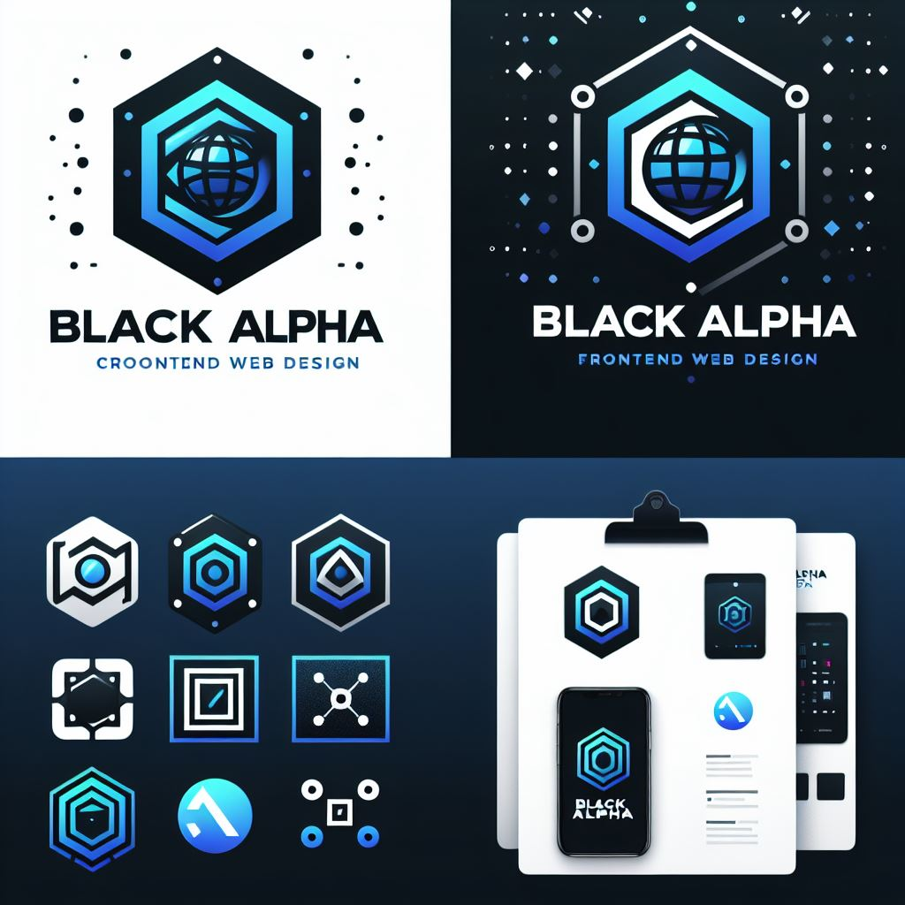

- 👋 Hi, I’m Charuka Mahesh
- 👀 I’m interested in Web Design
- 🌱 I’m currently learning cybersecurity && backend web design
- 💞️ I’m From Sri Lanka 🇱🇰
- 📫 How to reach me charukamahesh172@gmail.com

### 🎨 Web Designer |

Welcome to my GitHub! 👋 I'm passionate about web design. constantly exploring new technologies and pushing the boundaries of what's possible.

## About Me
- 💻 Web designer with a focus on 
- 🛠️ Hacking enthusiast, always learning and experimenting.
- 🌐 Portfolio: [Comming Soon]
- ✉️ Email: [charukamahesh172@gmail.com](mailto:charukamahesh172@gmail.com)
## Skills

- Frontend Development: HTML5, CSS3, JavaScript
- Design Tools: Adobe Creative Suite, Sketch, Figma
- 💻 Currently Learning: Cyber Security at ISC2

## Let's Collaborate!
I'm always open to collaborations and interesting

<!---
CharukaMahesh/CharukaMahesh is a ✨ special ✨ repository because its `README.md` (this file) appears on your GitHub profile.
You can click the Preview link to take a look at your changes.
--->
